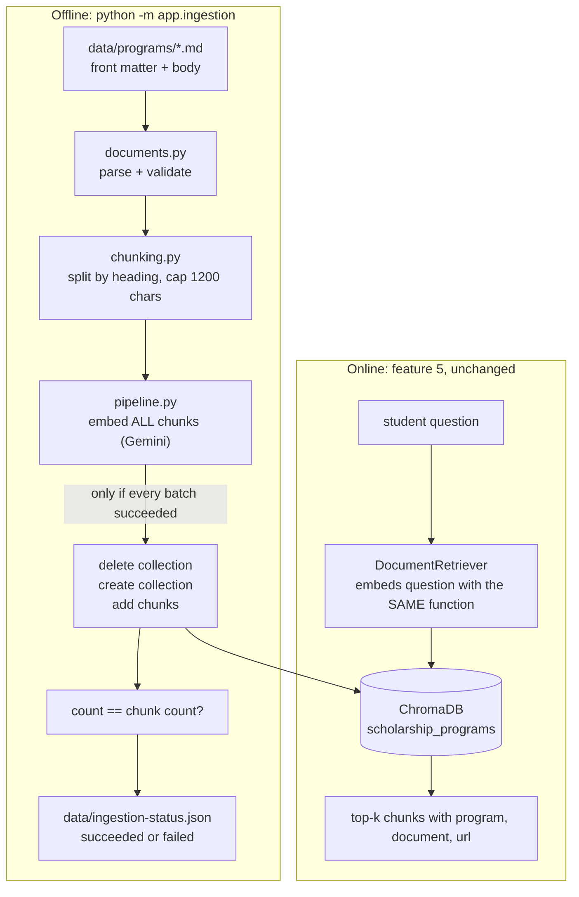

# 06 - Knowledge ingestion pipeline

## What

This feature built the part of ScholarLens that fills the knowledge base. One
command, `python -m app.ingestion`, reads a folder of program documents (ten
scholarship and grant summaries), cuts them into small pieces, converts each
piece into a list of numbers that captures its meaning, stores those in
ChromaDB, and writes a small JSON file recording how the run went.

Before this, the agent from feature 5 had a retrieval tool but nothing to
retrieve: the collection was empty, and the code treated "empty" as a normal
state. After this, asking "What GPA do I need for a Cal Grant A?" returns the
actual Cal Grant chunk, with the program name and official URL attached so the
answer can cite it.

It is the offline half of Agentic RAG. The agent (feature 5) is the online
half: it runs per question. Ingestion runs once, whenever the documents change.

## Why

The whole product promise is "we tell you what you qualify for and quote the
exact rule". A quote needs a source, and the source has to live somewhere the
agent can search. The cost of not having this feature is concrete: the agent
either retrieves nothing and always falls back to web search, or, worse, a
developer fills the store by hand once, nobody remembers how, and the next
person cannot reproduce it.

That second failure is why the build-plan line says "reproducible". The
original capstone had an `ingest.py` script, but it was never carried into this
repository (feature 4 found the same about the agent). So this feature is not
a port. It rebuilt ingestion so that:

- the same input always produces the same store (deterministic ids and chunks),
- a bad run cannot destroy a good store (validate and embed before deleting),
- every external call has a timeout (the project rule since feature 5),
- there is a record of what happened (the status file), which features 15 and 17
  will later turn into "ingestion health" on a dashboard.

## Key concepts

**Ingestion** is the batch job that prepares data for search. Think of a
library: before anyone can find a book, someone catalogues it, gives it a shelf
number, and files it. Ingestion is the cataloguing. It is separate from
answering questions because it is slow (network calls to an embedding model)
and only needs to happen when the documents change, not on every question.

**Retrieval-Augmented Generation (RAG)** means giving a language model relevant
text at question time instead of hoping it memorised the facts. A model asked
"what is the Pell Grant SAI cutoff for 2026-27?" will happily invent a number.
Handed the actual paragraph, it can quote it. RAG is "look it up, then answer",
and ingestion is what makes "look it up" possible.

**Chunking** is cutting documents into pieces before storing them. Two reasons:
you only want to hand the model the relevant paragraph, not a 40-page PDF (cost
and focus), and an embedding of a whole document blurs together everything in
it, so a search matches it weakly. Too small and a rule loses its context ("must
maintain a 3.0" - of what?); too big and the match gets fuzzy. Here, chunks
follow the document's own headings and are capped at 1200 characters, so one
chunk is usually one coherent list of rules.

**An embedding** is a list of numbers (for `gemini-embedding-001`, a few
thousand of them) that represents what a piece of text means. Texts with similar
meaning get similar numbers, which you can measure as distance. Analogy: giving
every text a street address in a giant city where similar ideas live on the same
block. "How many payments can I get?" and "the maximum number of allowable TAG
payments" have no words in common but land near each other.

**A vector database** (ChromaDB here) stores those number-lists next to the
original text and answers one question fast: "which stored chunks are nearest to
this query's address?" A **collection** is one named table of them.

**Index time vs query time.** Chunks are embedded when ingested (index time);
the student's question is embedded when asked (query time). Both must use the
same model, or the two sets of addresses come from different maps and distances
mean nothing. This is why the feature moved the embedding setup into one shared
function that both the retriever and the ingester call.

**Front matter** is a small header at the top of a text file, between `---`
lines, holding metadata as `key: value`. Here it carries the three things every
citation needs: `program`, `document`, `url`. It keeps the metadata in the same
file as the text, so they cannot drift apart.

**Deterministic identifiers.** A chunk id like `nj_tag#0002` is built from the
file path and position, not a random UUID. Running ingestion twice on the same
files yields the same ids and text. That is what makes a rebuild something you
can diff and reason about.

**A destructive rebuild and its blast radius.** "Re-ingest from scratch" means
deleting the collection and recreating it. Blast radius is how much damage a
failure at each step can do. Deleting first and then discovering the embedding
API is down leaves the live agent with an empty store. So the order matters
more than the code: do everything that can fail *before* the irreversible step.

**A timeout on a call that has none.** ChromaDB's client and the Gemini
embedding function do not give this code a timeout it can set per call. A
program calling one with a dead network can wait forever. The fix is to run the
call in a helper thread and stop waiting after N seconds. A **daemon thread** is
one Python will not wait for when the program exits, so a stuck call cannot keep
the process alive after we have already given up.

**An atomic write** means a file is either the old version or the new version,
never half-written. Write to a temporary file, then `os.replace` it over the
target; the swap is a single operation. It matters for the status file because
a reader (later, a dashboard) must never see broken JSON.

## Architecture



The safety property lives in one arrow: the step that can fail because of the
network (embedding) happens before the step that cannot be undone (delete).

```
input problem  -> fails before anything is touched      -> old store intact
embedding down -> fails before delete                   -> old store intact
Chroma down    -> fails at connect, before delete       -> old store intact
Chroma dies    -> fails after delete, mid-write         -> partial store, status says "failed",
   mid-write                                               re-run fixes it
```

The last row is the honest limit: a failure between "delete" and "count check"
can leave a partial collection. The spec accepted that (the retriever already
treats an empty store as normal) rather than building a staging-and-swap
scheme for a one-person project.

## What we actually built

Files, in the order data flows through them.

**The input contract** - files under [../backend/data/programs/](../backend/data/programs/),
for example [nj_tag.md](../backend/data/programs/nj_tag.md):

```
---
program: New Jersey Tuition Aid Grant (TAG)
document: Eligibility summary
url: https://www.hesaa.org/Pages/TAG.aspx
---
## Eligibility

- Must be a New Jersey resident for at least 12 consecutive months ...
```

**[documents.py](../backend/app/ingestion/documents.py)** finds every `.md`/`.txt`
file, parses the header with the standard library (no YAML dependency for three
keys), and returns validated `SourceDocument` objects. It raises
`IngestionInputError` naming the file for a missing key, a non-http(s) URL, an
empty body, or two files that would get the same id (`a.md` and `a.txt`). The
messages carry paths, never file contents.

**[chunking.py](../backend/app/ingestion/chunking.py)** does three things in order:
split at Markdown headings (`#` to `###`), pack whole paragraphs into chunks up
to `max_chars`, and only if a single paragraph is too long, split it at
sentence ends and then hard-cut as a last resort. There is deliberately no
overlap between chunks, so a rule stays whole inside one chunk and a quoted
`supporting_clause` matches the source exactly. Each chunk's `section` (the
nearest heading) becomes a clause reference. `Chunk.metadata()` produces the six
string fields Chroma stores; `program`, `document`, `url` are exactly what the
retriever already read.

**[pipeline.py](../backend/app/ingestion/pipeline.py)** is the orchestration:

```python
embedding_function, embeddings = _embed_chunks(settings, chunks)   # can fail; nothing touched yet
client = _bounded(lambda: get_chroma_client(settings), timeout, "chroma connect")
_bounded(drop_existing, timeout, "chroma delete")                   # first irreversible step
collection = _bounded(lambda: client.create_collection(...), timeout, "chroma create")
_write_chunks(collection, chunks, embeddings, timeout)
if _bounded(collection.count, timeout, "chroma count") != len(chunks): ...
```

`_bounded` is the timeout helper described above. Embeddings are computed here,
not by Chroma, so they exist before the old collection is deleted; the new
collection is still created with the same embedding function so questions get
embedded the same way later. Failures become a `failed` status object instead of
a crash, and error strings are fixed short phrases plus the exception class
(for example `chroma connect failed (ValueError)`), because a provider's own
message could contain payloads.

**[__main__.py](../backend/app/ingestion/__main__.py)** is the command: no
arguments (settings drive everything), one summary line on success, the reason on
stderr and exit code 1 on failure.

**Shared setup.** [retrieval/client.py](../backend/app/retrieval/client.py) gained
`get_chroma_client` and `build_embedding_function`, extracted from the
retriever's private method with no behaviour change, and
[config.py](../backend/app/config.py) gained four settings
(`ingestion_source_dir`, `ingestion_status_path`, `ingestion_chunk_max_chars`,
`ingestion_timeout_seconds`).

**The corpus.** Ten summaries converted from the original capstone repository's
PDFs. A script rejoined wrapped lines and turned labels like `Eligibility:` into
headings, and asserted the words matched the PDF text exactly. The result: 10
documents, 23 chunks.

### Decisions and things that went sideways

- **Markdown, not PDFs.** The plan talks about "rules buried in PDFs", but reading
  PDFs directly needs a parser dependency and page-aware chunking. The spec chose
  text files and treated PDF-to-text as a one-time conversion outside the pipeline.
- **A Python version slip.** The first version used `def f[T](...)`, a syntax
  added in Python 3.12. The venv is 3.14, so it ran fine locally, but the project
  targets 3.11 (the Dockerfile and ruff both say so). The Docker Compose run on
  3.11 is what would have caught it; it was fixed to use `TypeVar` beforehand.
  Lesson: the interpreter you develop on is not the contract.
- **A review finding.** The sentence splitter first discarded the whitespace
  between sentences and rejoined with a single space, which alters text inside
  over-long paragraphs and weakens "quote it verbatim". It now splits with a
  zero-width pattern so concatenating the pieces reproduces the original.
- **A cold-start surprise.** The very first `retrieve` after starting Chroma
  timed out at the retriever's 5 second limit: client setup plus a Gemini call
  exceeded it. A second call took about a second. Not a bug in this feature, but a
  real production caveat (see next).
- **The corpus is summaries, not official text.** The PDFs were the capstone
  team's short summaries, each citing an official page. Checking a few against
  the live pages found two real errors in the NJ TAG file (payment limits read
  "4.5 semesters / 2.5" but the page says 9 and 5 payments; the award year was
  2025-26, the table says 2026-27), both fixed. Pell, Cal Grant, and Florida
  could not be fetched, and TAG's "$70,000-$80,000 income" figure is not on the
  official page at all. So the agent quotes a summary and links the official
  page; the summary's accuracy is only partly verified.

### How we know it works

No test runner exists yet (feature 19), so the evidence is running the real
thing:

- `ruff check .` passes.
- On a scratch corpus: identical ids and text across two runs, no chunk over the
  size cap, every chunk has a section, and each bad-input case names its file.
- Live against Compose ChromaDB and the real Gemini API: ingestion succeeded and
  `DocumentRetriever` returned the right program and URL for one question about
  each of the ten programs.
- Failure cases: an empty source folder failed and left the existing 13-chunk
  collection intact; a wrong port and an unreachable host both exited 1 within the
  timeout, with a `failed` status record.
- `docker compose ... run --rm backend python -m app.ingestion` worked on
  Python 3.11.

## What's next

- **Feature 7, evaluation pipeline.** Now that real documents exist, the
  hand-labeled student profiles (the capstone repo has 30 in
  `eval/golden_profiles.json`) can be run against the agent, and "citation
  accuracy" means something. Weak or wrong corpus text will show up there as
  wrong cited clauses, so the unverified summaries are worth fixing first.
- **Features 14 and 15, tracing and metrics.** Ingestion currently records
  only a JSON file. "Ingestion health" on a dashboard needs that turned into
  metrics (last success time, chunk count, failure count).
- **Feature 17, the `/ops` view** will read the status file, or a summary
  endpoint over it.
- **Feature 18, hardening.** There is no ingestion endpoint on purpose. If one
  is ever added, it must be protected: it deletes the shared collection. The
  cold-start timeout above also belongs here (warm the retriever at startup, or
  raise the first-call limit) before a real deploy in feature 20.
- **Later, not v1.** Incremental ingestion (only changed files), PDF sources, and
  hybrid search were deliberately left out at this corpus size (23 chunks).
