# 14 - OpenTelemetry instrumentation

## What

Feature 13 gave the backend a diary: JSON log lines, each stamped with the
request's correlation ID. A diary tells you *that* something happened. It
doesn't tell you *where the time went* or *which step called which*. When a
student waits 30 seconds for an answer, the log shows one line, "request
completed, 30000 ms", and nothing else.

Feature 14 adds **distributed tracing**. Every `/eligibility` request now
produces a **trace**: a tree of timed steps. The root is the HTTP request.
Under it sit the agent run, each call to Gemini (with the model name and token
counts), each tool call the agent makes, and inside the retrieval tool, the
embedding step and the ChromaDB query as separate pieces. Each step records how
long it took and whether it failed. Failures record only the exception's type,
never its message.

The backend sends these traces, over a standard protocol called **OTLP**, to
the **OpenTelemetry Collector** container in the Docker Compose stack. The
collector prints them to its log. With an opt-in override file, it also
forwards them to **Grafana Cloud Tempo**, a hosted store where you can search
traces and look at them as timeline charts. None of the student's words ever
leave the process: not the description, not the prompt, not the tool queries,
not the model's answer.

## Why

Picture a student reporting "it took forever and then said the engine was
unavailable". With feature 13 alone you can find their request by its
correlation ID and read one WARNING line: `agent run timed out`. That's where
the trail ends. Was it:

- Gemini being slow on the first call?
- The agent calling web search three times in a row?
- ChromaDB hanging until its 5-second timeout?
- The embedding step, which also calls Google, being slow?

An agent is the hardest kind of program to answer this for, because **its path
is decided at runtime by a language model**. The same request can take two
tool calls one time and five the next. You can't read the code and know what
happened. You have to record what happened.

Without tracing, there are three concrete costs:

- **Latency is a black box.** You know the total, not the parts, so you can't
  tell a slow model from a slow tool from a slow database.
- **Agent behavior is invisible.** Did it retrieve first, as the system prompt
  demands? Did it fall back to web search, and why? How many tokens did that
  cost? The only record is inside the model provider's billing page.
- **Phase 4 has nothing to build on.** Metrics (15), dashboards (16) and the
  `/ops` view (17) all want per-step timings and per-tool counts. Traces are
  where those numbers come from.

This session showed the value directly. A burst of 503s turned out to be
**three different Gemini problems**: a free-tier quota (429), a retired model
(404) and an overloaded model (503). They all looked identical to the student.
The trace was what showed which model the request actually asked for
(`gen_ai.request.model`), and where in the tree the `ModelHTTPError` happened.

The same tension as feature 13 applies: ScholarLens promises never to record
student profiles. Tracing libraries are *designed* to capture as much as they
can, including prompts, tool arguments and exception messages, because that's
what makes debugging easy. Much of this feature is about switching that off,
and proving that it stayed off.

## Key concepts

### A trace and a span

A **span** is one timed piece of work: a name, a start time, an end time, and
some labels. "Call Gemini" is a span. "Query ChromaDB" is a span.

A **trace** is the tree of every span belonging to one piece of work that
started somewhere, here one HTTP request. Each span (except the root) records
its **parent span**, and that's what turns a pile of timings into a tree.

An analogy: a trace is an itemized receipt for a restaurant order. The total
is at the bottom (the root span), but each line (starter, main, drinks) has its
own amount (duration), and some lines have sub-lines ("main: steak + side of
fries"). Feature 13's log line was the total. Feature 14 is the itemization.

Every span in a trace shares one **trace ID**, a random 128-bit number.
Each span also has its own **span ID**. The parent/child links are span IDs
pointing at other span IDs.

### Attributes, status, and events

A span carries three kinds of extra information:

- **Attributes** are key-value labels, for example
  `gen_ai.request.model = "gemini-3.8-flash"` or
  `app.retrieval.result_count = 5`. They are what you search and group by
  later.
- **Status** is `UNSET`, `OK` or `ERROR`, plus an optional description. It
  answers "did this step fail?".
- **Events** are timestamped notes inside a span. The most common is the
  `exception` event, which by default records the exception's type, its
  **message**, and its **stack trace**. Remember that last point; it's where the
  worst bug in this feature lived.

### Semantic conventions: agreeing on attribute names

If every library invented its own names (`model`, `llm_model`, `modelName`),
dashboards couldn't work across them. **Semantic conventions** are a published
list of standard attribute names. This feature uses several:

- `http.route`, `http.response.status_code`: HTTP.
- `db.system.name`: which database (`chromadb`).
- `error.type`: the failure's class name.
- `gen_ai.*`: the newer **GenAI conventions** for language-model calls.
  Examples are `gen_ai.request.model`, `gen_ai.usage.input_tokens`,
  `gen_ai.usage.output_tokens` and `gen_ai.tool.name`.

Our own labels use an `app.` prefix (`app.request_id`,
`app.agent.tool_calls`), and our own span names use `scholarlens.*`, so they
can't collide with any standard.

### OpenTelemetry: API vs SDK

**OpenTelemetry** (OTel) is the vendor-neutral standard for traces, metrics
and logs. In Python it comes as two layers, and the split matters:

- The **API** (`opentelemetry-api`) is what code calls to create spans:
  `tracer.start_as_current_span("...")`. On its own it does *nothing*. Every
  call is a cheap no-op.
- The **SDK** (`opentelemetry-sdk`) is the machinery that actually records
  spans and ships them somewhere. You install and configure it once, at
  startup.

This split is why a library like Pydantic AI can put tracing calls in its code
without forcing anyone to collect anything: until an application configures
the SDK, those calls cost almost nothing. It's also how ScholarLens turns
tracing off. If no collector endpoint is configured, we never set up the SDK,
and every span in the codebase quietly becomes a no-op.

### Tracer provider, processor, exporter

Setting up the SDK means wiring three objects together:

- A **tracer provider** is the factory every `tracer` comes from. It also
  holds the **resource**: labels describing *who* emitted the spans
  (`service.name = "scholarlens-api"`, `service.version = "0.1.0"`).
- A **span processor** decides what happens when a span ends. The
  **`BatchSpanProcessor`** queues finished spans and sends them in batches from
  a background thread, so a request never waits on the network to export its
  own trace.
- An **exporter** knows the wire format and destination. We use an **OTLP
  exporter**.

### OTLP and the collector

**OTLP** (OpenTelemetry Protocol) is the standard wire format for sending
telemetry, over gRPC (port 4317) or HTTP (port 4318).

The **OpenTelemetry Collector** is a separate program that receives OTLP,
optionally processes it, and forwards it to one or more backends. Why not send
spans straight from the app to Grafana?

- **Decoupling.** The app only knows "send OTLP to the collector". Changing
  where traces end up (a local log, Tempo, both) is a collector config change,
  not an app change.
- **Credentials stay out of the app.** The Grafana token lives in the
  collector's environment, not in the backend.
- **Buffering.** The collector batches and retries, so a slow Grafana doesn't
  slow the app.

The collector's config is a small pipeline: **receivers** (OTLP in),
**processors** (batch), and **exporters** (out). Ours has two exporters:
`debug` prints every span to the collector's own log, and `otlp_http/grafana`
forwards to Tempo.

**Grafana Tempo** is a trace database. You search by service, span name, or
attribute, then open a trace as a waterfall chart: one bar per span, positioned
by start time, nested by parent.

### Auto-instrumentation vs manual spans

- **Auto-instrumentation** is a library that wraps a framework and creates
  spans for you. `FastAPIInstrumentor` wraps the FastAPI app so every request
  automatically gets a root "server span" (`POST /eligibility`) with its route
  and status code.
- **Library-native instrumentation** is spans that a library emits itself.
  Pydantic AI does this: once told to, it creates spans for the agent run, each
  model call (`chat gemini-3.8-flash`) and each tool call
  (`execute_tool retrieve_program_rules`), with GenAI attributes filled in.
- **Manual spans** are ones we write ourselves, for work no library knows
  about: our agent wrapper, our retrieval steps, our Tavily call.

### Context propagation: how a span finds its parent

When you start a span, how does it know its parent? Through the **current
context**, the "span that is active right now", which OpenTelemetry stores in a
Python **context variable**. That's the same `contextvars` mechanism feature 13
used for the correlation ID. `start_as_current_span` makes the new span current
for the duration of its `with` block, so any span started inside it becomes its
child automatically.

The catch: context variables follow **async tasks**, but **not threads**. Our
ChromaDB query runs in a thread pool (`run_in_executor`), because the ChromaDB
client is blocking. A span started on that thread sees an empty context, so it
thinks it has no parent and starts a **brand new trace**. The fix is to
snapshot the context (`contextvars.copy_context()`) and run the thread's work
inside that snapshot (`context.run`).

### Redaction: telemetry is a data export

Every attribute and event you record is **copied off the machine**, and with
Grafana Cloud, to a third party. So a trace is not "internal debugging data".
It's an export of whatever you put in it. The rules this feature enforces:

- **No content.** Pydantic AI's `include_content=False` strips the prompt, the
  model's response, and tool arguments and results from its spans. It keeps
  their *shape*: the message roles and the tool names.
- **Type, not message.** A failed span records `error.type = "TimeoutError"`,
  never `str(exc)`. A provider's error message can quote the request that
  caused it, which can contain the student's description.
- **No headers or bodies.** We never enable the FastAPI instrumentor's header
  or body capture.

## Architecture

```text
 browser / curl
      |  POST /eligibility
      v
+-----------------------------------------------------------------+
| FastAPI app (backend container)                                 |
|                                                                 |
|  OpenTelemetry middleware (FastAPIInstrumentor, outermost)      |
|    span: "POST /eligibility"   <- root, app.request_id          |
|    |                                                            |
|    CorrelationIdMiddleware  (catches every unexpected error     |
|    |                         so it never reaches the span above)|
|    CORS -> router -> check_eligibility                          |
|        span: scholarlens.agent.run      (app.agent.tool_calls)  |
|          span: invoke_agent agent           <- Pydantic AI      |
|            span: chat gemini-3.8-flash      (model, tokens)     |
|            span: execute_tool retrieve_program_rules            |
|              span: scholarlens.retrieval.retrieve               |
|                 [copy_context -> thread pool]                   |
|                span: scholarlens.retrieval.embed  (Gemini emb.) |
|                span: scholarlens.retrieval.query  (ChromaDB)    |
|            span: chat gemini-3.8-flash                          |
|            span: execute_tool search_the_web   (only if needed) |
|              span: scholarlens.web_search.search (Tavily)       |
|            span: chat gemini-3.8-flash   (final structured JSON)|
|                                                                 |
|  TracerProvider -> BatchSpanProcessor -> OTLPSpanExporter (gRPC)|
+-------------------------------|---------------------------------+
                                | OTLP gRPC :4317 (background thread)
                                v
+-----------------------------------------------------------------+
| otel-collector container                                        |
|   receiver: otlp  ->  processor: batch  ->  exporters:          |
|                                              debug (stdout)     |
|                                              otlp_http/grafana  |
|                                              (override only) ---+--> Grafana Cloud Tempo
+-----------------------------------------------------------------+     (basic auth)
```

The same tree as a Tempo waterfall would look roughly like this:

```mermaid
gantt
    dateFormat X
    axisFormat %s
    section request
    POST /eligibility            :0, 14
    section agent
    scholarlens.agent.run        :1, 13
    chat (pick tool)             :1, 3
    retrieve_program_rules       :3, 5
    chat (maybe web search)      :5, 7
    search_the_web               :7, 10
    chat (final answer)          :10, 13
```



Tracing is **off by default**. `configure_tracing` returns immediately unless
`OTEL_EXPORTER_OTLP_ENDPOINT` is set. The Docker Compose backend sets it to
`http://otel-collector:4317`. A plain `uvicorn` run on your machine doesn't,
so it stays quiet unless you opt in.

## What we actually built

Seventeen files changed. The only new package is
`opentelemetry-instrumentation-fastapi`. The SDK and the gRPC OTLP exporter
were already installed as dependencies of `chromadb`, so the change just
declared them explicitly in
[`pyproject.toml`](../backend/pyproject.toml).

### The switch and the plumbing: [`app/telemetry.py`](../backend/app/telemetry.py)

```python
def configure_tracing(settings: Settings, app: FastAPI) -> None:
    """Export spans when a collector endpoint is set; otherwise leave the no-op tracer in place."""
    if not settings.otel_exporter_otlp_endpoint:
        return

    provider = TracerProvider(
        resource=Resource.create({"service.name": SERVICE_NAME, "service.version": app.version})
    )
    provider.add_span_processor(
        BatchSpanProcessor(
            OTLPSpanExporter(
                endpoint=settings.otel_exporter_otlp_endpoint,
                timeout=settings.otel_export_timeout_seconds,
            )
        )
    )
    trace.set_tracer_provider(provider)
    # Health probes run every few seconds and would drown out real traffic in Tempo.
    FastAPIInstrumentor.instrument_app(
        app, excluded_urls="/health$", exclude_spans=["receive", "send"]
    )
```

Things worth noticing:

- **Two new settings** in [`app/config.py`](../backend/app/config.py):
  `otel_exporter_otlp_endpoint` (defaults to `None`, meaning off) and
  `otel_export_timeout_seconds` (5.0). The project rule is "explicit timeout on
  every external call", and exporting to the collector is one.
- **`service.version` comes from `app.version`.** A first draft hard-coded
  `"0.1.0"` a third time. The code review flagged the duplication, so it now
  reads the version FastAPI already has.
- **`/health` is excluded.** Compose checks the backend's health every 10
  seconds. Without the exclusion, Tempo would fill with thousands of useless
  one-span traces.
- **`exclude_spans=["receive", "send"]`** drops ASGI's internal "read a chunk of
  the body" and "write a chunk of the response" spans, which add noise and
  explain nothing.
- `configure_tracing` is called from [`app/main.py`](../backend/app/main.py)
  right after the middleware is registered, before the first request.

The same file holds the one helper every manual span uses:

```python
@contextmanager
def traced_span(name: str) -> Iterator[Span]:
    """A span that records a failure by exception type only, never its message."""
    with _tracer.start_as_current_span(
        name, record_exception=False, set_status_on_exception=False
    ) as span:
        try:
            yield span
        except Exception as exc:
            # A provider exception's message can echo the prompt or tool query.
            error_type = type(exc).__name__
            span.set_attribute("error.type", error_type)
            span.set_status(Status(StatusCode.ERROR, error_type))
            raise
```

`start_as_current_span` defaults to `record_exception=True` (add an
`exception` event with the message) and `set_status_on_exception=True` (put
`"TimeoutError: <message>"` in the status). Both would leak. The helper turns
both off and records only the class name.

The first draft didn't have this helper. It called `start_as_current_span`
directly in each file with a separate "mark failed" function. The embed and
query spans inside retrieval had been written with the defaults, so they would
have recorded messages. Moving the rule into one helper meant there was one
place to get it right.

### Correlation ID meets trace: [`app/api/middleware.py`](../backend/app/api/middleware.py)

```python
# Lets a trace be found from any log line of the same request.
trace.get_current_span().set_attribute("app.request_id", request_id)
```

One line joins feature 13 to feature 14. The FastAPI instrumentor's middleware
wraps everything, so by the time `CorrelationIdMiddleware` runs, the current
span *is* the server span. Stamping the request ID on it means you can take a
correlation ID from a log line (or the `X-Request-ID` response header), search
Tempo for `app.request_id`, and land on the exact trace.

### The agent: [`app/agent/agent.py`](../backend/app/agent/agent.py)

Two changes. First, Pydantic AI is told to trace itself, without content:

```python
agent: Agent[_Deps, EligibilityResult] = Agent(
    model,
    deps_type=_Deps,
    output_type=EligibilityResult,
    system_prompt=_SYSTEM_PROMPT,
    # Spans keep model, token usage, and tool names; prompts and tool payloads carry
    # student data, so they stay out of telemetry.
    capabilities=[Instrumentation(settings=InstrumentationSettings(include_content=False))],
)
```

**A bug on the way.** The spec (and the first implementation) wrote this as
`Agent(..., instrument=InstrumentationSettings(...))`. It passed lint and the
import check, because nothing constructs the agent at import time. The first
live request through Docker returned 503, and the log said
`agent construction failed, error_type: TypeError`. The Docker image had
installed Pydantic AI **2.49**, the venv had **2.44**, and **neither** accepts
`instrument=` as a constructor argument. In these versions instrumentation is
a **capability** passed in `capabilities=[...]`. The lesson: "it imports" is
not "it works", and a Docker image built without pinned versions can drift
from your venv. Dependency pinning is feature 18.

Second, the whole run is wrapped in our own span, so the timeout (which Pydantic
AI can't see, because `asyncio.wait_for` cancels it from outside) shows up in
the trace:

```python
try:
    with traced_span("scholarlens.agent.run") as span:
        run_result = await asyncio.wait_for(
            self._agent.run(_build_prompt(request), deps=deps),
            timeout=self._run_timeout_seconds,
        )
        span.set_attribute("app.agent.tool_calls", deps.tool_calls)
except TimeoutError as exc:
    ...
```

The `try` is *outside* the `with`. That ordering matters. The exception passes
through `traced_span` first, which records the original type (`TimeoutError`,
`RetrievalUnavailableError`). Only then do the existing `except` blocks convert
it to `EligibilityEngineError` for the API. If the span were outside the `try`,
every failure would be recorded as `EligibilityEngineError`, which tells you
nothing.

### Retrieval, split in two: [`app/retrieval/client.py`](../backend/app/retrieval/client.py)

Retrieval used to be one call: `collection.query(query_texts=[query])`. Inside
that call, ChromaDB quietly asks Google for an embedding, *then* searches. Two
very different operations (a paid network call to Google, a local vector search)
would hide in one span.

So the code now does the two steps itself:

```python
with traced_span("scholarlens.retrieval.embed") as span:
    span.set_attribute("gen_ai.request.model", self._settings.embedding_model)
    embeddings = embedding_function.embed_query(input=[query])
with traced_span("scholarlens.retrieval.query"):
    result = collection.query(
        query_embeddings=embeddings, n_results=self._settings.retrieval_top_k
    )
```

The risk with a change like this is subtly changing the vectors. ChromaDB's
own `query_texts` path calls `embedding_function.embed_query` (checked in
ChromaDB's `CollectionCommon._embed`), so calling the same method on the same
object gives the same vectors. This was checked: old path and new path
returned identical chunks for the same query.

Then the thread-pool problem from Key concepts:

```python
# Executor threads don't inherit contextvars, so child spans would start new traces.
context = contextvars.copy_context()
chunks = await asyncio.wait_for(
    loop.run_in_executor(self._executor, context.run, self._query, query),
    timeout=self._settings.chroma_timeout_seconds,
)
```

`context.run(self._query, query)` runs `_query` inside the snapshot, so the
embed and query spans find `scholarlens.retrieval.retrieve` as their parent.

### Web search: [`app/tools/web_search.py`](../backend/app/tools/web_search.py)

The Tavily call is wrapped in `scholarlens.web_search.search`, recording the
provider, the HTTP status code (set *before* `raise_for_status`, so a 500 still
gets its status on the span) and the number of results. The Tavily API key
travels in the request body, which is never attached to the span.

A first draft split `search` into a wrapper plus `_search(query, span)` just to
hand the span down. The review called that out (a telemetry type leaking into
the search logic), and the span now simply wraps the original body.

### The leak an independent reviewer found (F-21)

Everything above was verified live. The collector output was searched for a
marker word planted in the request, and it appeared zero times, on successful
requests and with ChromaDB stopped. The first `/complete` still ran an
**independent review**: a fresh agent with no memory of the build, auditing
the diff from scratch. It found a **P1 leak**.

The FastAPI instrumentor adds its own exception-handling middleware *around*
the app's middleware. When an exception escaped all the way out (the case
feature 13's catch-all 500 handler exists for), that outer layer called
`span.record_exception(exc)`. That puts `exception.message` and
`exception.stacktrace` on the server span, and ships them to Tempo. The
reviewer proved it with a **fault injection**: a request whose handler raised
`RuntimeError(<the student's description>)` produced a correct, redacted 500
response and a clean log, but the exported span carried the description word
for word.

Why the live checks missed it: today's code never lets an exception escape
that far (the agent converts all its failures), so no real request could
trigger it. It was a trap for the next bug, not a current leak.

The fix moves the catch *inside* the tracing layer:

```python
try:
    response = await call_next(request)
except Exception as exc:
    # Handled here, inside the tracing middleware, because an exception that escapes
    # gets its message recorded on the exported server span.
    response = unhandled_error_response(request, exc)
```

`unhandled_error_response` in [`app/api/errors.py`](../backend/app/api/errors.py)
is the old 500 handler's body pulled out into a function: log the type and stack
frames (never the message), return the `internal_error` envelope. The old
`@app.exception_handler(Exception)` still exists as a fallback for a failure in
the middleware itself. `REQUEST_ID_HEADER` moved into
[`app/logging.py`](../backend/app/logging.py), because `middleware.py` now
imports from `errors.py`, and `errors.py` used to import the header name from
`middleware.py`, which would have been a circular import.

The same probe run against the old commit showed the leak, and run against the
fix showed a server span with `ERROR` status, no events and no marker. A second
fresh review confirmed it and closed F-21. The general lesson: **"I searched
the output and the secret wasn't there" only covers the paths you exercised.**
A redaction rule needs a deliberate attempt to break it.

### Grafana Cloud: [`infra/`](../infra/)

The base stack ([`docker-compose.yml`](../infra/docker-compose.yml)) sets the
backend's endpoint to the in-network collector, and the collector keeps its
`debug` exporter. It runs with no credentials at all.

Sending traces to Tempo is an **override file**, a second Compose file layered
on top of the first:

```bash
docker compose -f infra/docker-compose.yml -f infra/docker-compose.grafana.yml up
```

[`docker-compose.grafana.yml`](../infra/docker-compose.grafana.yml) gives the
collector a second `--config` (the collector merges them) and loads
`infra/.env`. [`otel-collector-grafana.yaml`](../infra/otel-collector-grafana.yaml)
adds the Tempo exporter:

```yaml
extensions:
  basicauth/grafana:
    client_auth:
      username: ${env:GRAFANA_CLOUD_INSTANCE_ID}
      password: ${env:GRAFANA_CLOUD_API_TOKEN}

exporters:
  otlp_http/grafana:
    endpoint: ${env:GRAFANA_CLOUD_OTLP_ENDPOINT}
    auth:
      authenticator: basicauth/grafana
```

Two details from getting it running:

- **Grafana's "connection details" page hands you a header, not a username and
  password.** It shows `OTEL_EXPORTER_OTLP_HEADERS` with one base64 string,
  which decodes to `instanceID:token`. That's exactly HTTP basic auth
  pre-encoded. The instance ID and token went into `infra/.env` (gitignored)
  by decoding it locally, never printed.
- **`otlphttp` was renamed.** The collector logged `"otlphttp" alias is
  deprecated; use "otlp_http"`. It was renamed and the deprecation warning
  disappeared. The collector image is still on `:latest`, which is why a name
  can shift under you.

The export was verified as far as it could be from the machine: across four
traced requests, the collector logged zero `Exporting failed` lines (a bad
token shows up there as a 401). Then you confirmed the traces in Tempo's
Explore view.

### How we know it works

- `ruff check .` after every step.
- **Span tree:** a live request through Compose produced the full nesting shown
  in Architecture, all under one trace ID. It showed three
  `chat gemini-*` spans with `gen_ai.usage.input_tokens`/`output_tokens`,
  `app.request_id` matching the `X-Request-ID` header, and no span for
  `GET /health`.
- **Redaction:** marker words planted in the request (description, state,
  major) appeared 0 times in the collector output, on the happy path and with
  `docker compose stop chromadb`. Failures showed only `error.type`
  (`TimeoutError`, `ConnectError`, `RetrievalUnavailableError`).
- **Pydantic AI's own spans:** confirmed in its source that exception recording
  honors `include_content`, and in the output that its `exception` events
  carried only `exception.type`.
- **Retrieval unchanged:** old `query_texts` path and new embed-then-query path
  returned identical chunks.
- **Tracing off:** with no endpoint set, the app served requests with the no-op
  `ProxyTracerProvider`.
- **Grafana override:** `otelcol validate` accepted the merged config, zero
  export failures, and traces visible in Tempo.
- **F-21:** in-process fault injection with an `InMemorySpanExporter` (an
  exporter that keeps spans in a Python list instead of sending them), before
  and after the fix, confirmed by an independent reviewer.

## What's next

- **Feature 22, provider rate-limit handling** (moved up to be next): the
  traces already show *that* Gemini failed (`error.type: ModelHTTPError`).
  Feature 22 teaches the backend to tell the student *which* failure it was:
  quota, model gone, or overloaded.
- **Feature 15, Prometheus metrics:** traces answer "what happened to *this*
  request". Metrics answer "what's happening to *all* requests": request rate,
  p95 latency, error rate, tool-call counts, token usage over time. Several
  metrics can come from the same places the spans do.
- **Feature 16, Grafana dashboards,** and **17, `/ops`:** built on Tempo traces
  plus those metrics.
- **Feature 18, reliability and security:** two things from this feature land
  there. First, pinning dependencies (the `instrument=` crash came from
  unpinned Pydantic AI versions). Second, the default span attributes
  `net.peer.ip` (the client's IP address, which is personal data) and
  `http.user_agent`, which currently reach Grafana with the override. The
  independent reviews flagged both as outside this spec's redaction list, but
  worth deciding on.
- **Feature 19, testing:** the F-21 probe was a one-off script. A real test
  that injects a message-bearing exception and asserts that no exported span
  contains it would keep a future middleware reorder from reopening the leak.
- **Feature 20, deploy:** Render won't run the collector container. The app
  can export straight to Grafana's OTLP gateway by setting
  `OTEL_EXPORTER_OTLP_ENDPOINT` and headers, or the deployment can run a
  collector sidecar. Either way the app code doesn't change, which is the
  point of the collector split.
